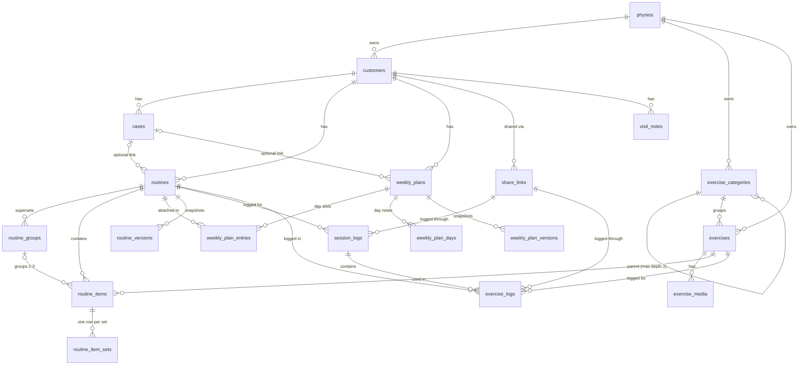

# Architecture

This is the source of truth for decisions that cut across features. Feature specs in
[`docs/specs/`](./specs/README.md) build on it. If a spec contradicts this file, stop and fix
one of them before writing code.

## Product in one paragraph

Physio Trainer lets a physiotherapist manage their **customers** (patients), record their
**injury cases**, build **routines** from a personal **exercise library** (with videos and
media, organised in categories), group routines into **weekly plans**, and share everything
with the patient through a **clean link that needs no account**. Patients can follow a guided
workout, log sessions and pain, and download a PDF. Everything a physio creates is private to
that physio.

## Decisions log (from the initial brainstorm, 2026-09-27)

| Topic                | Decision                                                                                                                                                                                                                                                                               |
| -------------------- | -------------------------------------------------------------------------------------------------------------------------------------------------------------------------------------------------------------------------------------------------------------------------------------- |
| Tenancy              | Multi-tenant from day one; one physio per account; data model leaves room for clinics later. No billing yet.                                                                                                                                                                           |
| Languages            | i18n from the start (next-intl). Locale is **not** in the URL. Physio UI locale from profile/cookie; patient pages use the customer's `locale`. Signed-out visitors get `Accept-Language` and a switcher. Ships with `en` and `es` (Rioplatense); every feature ships in every locale. |
| Privacy              | Health data. Tenant isolation enforced by Postgres RLS plus explicit filters. No health data in URLs; link previews carry only branding and the routine/plan title the physio typed.                                                                                                   |
| Patient access       | No account. Share link per customer (always shows what is currently active) plus optional links for a single routine/plan. Revocable, optional expiry, optional 4-digit PIN.                                                                                                           |
| Link format          | `/{physio-handle}/{slug}-{code}`, e.g. `/maria-lopez/ana-7k2m9qpx`. `code` is 8 random Crockford base32 chars and is the only lookup key; `handle` and `slug` are cosmetic and redirect to canonical when stale.                                                                       |
| Patient input        | Patients log sessions (done, pain 0–10, RPE 0–10, comment) from v1 (feature D) and, per exercise, pain, RPE, weight (kg) and a comment (spec 19).                                                                                                                                      |
| Routine types        | **Single routine** (shared on its own) and **weekly plan** (Mon–Sun, each day has 0..n routines, e.g. gym + rehab).                                                                                                                                                                    |
| Weekly plans         | One repeating 7-day template. Routines are attached by reference (edit once, updates every day); "make a separate copy" to diverge. Optional per-entry label ("Morning").                                                                                                              |
| Progression          | "Copy into next phase" with start/end dates (feature B) rather than multi-week plans.                                                                                                                                                                                                  |
| Categories           | Two levels (category → sub-category); an exercise can be in several. Rehab and gym exercises share one library.                                                                                                                                                                        |
| Media                | YouTube links only in v1 (spec 03); uploads (≤ 50 MB, Supabase Storage) and Vimeo are deferred.                                                                                                                                                                                        |
| Export               | Branded PDF (with QR code back to the live link) and Excel `.xlsx`.                                                                                                                                                                                                                    |
| Login                | Supabase Auth: magic link + Google.                                                                                                                                                                                                                                                    |
| Platform             | Responsive web; physio app installable with an offline fallback page (spec 18); patient page mobile-first and installable (per-link manifest).                                                                                                                                         |
| Design               | Minimal, neutral palette, one accent colour (overridable per physio on patient-facing surfaces), light + dark.                                                                                                                                                                         |
| In scope now         | Features A (templates), B (phases), C (workout mode), D (logging), E (link previews), F (branding), H (body areas), I (version history), J (visit notes).                                                                                                                              |
| Out of scope for now | Seed library/CSV import (G), outcome measures (K), offline patient view (L), AI assist (M), GDPR tooling (N), reminders (O), clinics/teams, billing.                                                                                                                                   |

## Stack

| Concern    | Choice                                                                                                                                                                                        |
| ---------- | --------------------------------------------------------------------------------------------------------------------------------------------------------------------------------------------- |
| Framework  | Next.js 16 (App Router, React 19, Server Components, Server Actions, `proxy.ts`). **Read `node_modules/next/dist/docs/` before using an API**: this version differs from older training data. |
| Language   | TypeScript (strict)                                                                                                                                                                           |
| UI         | Tailwind CSS v4, shadcn/ui (`radix-mira` style from preset `b1D0dxHE`, neutral, Radix primitives in `src/components/ui`), lucide-react icons, Outfit font (`next/font/google`), next-themes   |
| Database   | Supabase Postgres 17. Drizzle ORM for schema, migrations and queries                                                                                                                          |
| Auth       | Supabase Auth via `@supabase/ssr` (cookie sessions refreshed in `src/proxy.ts`)                                                                                                               |
| Files      | Supabase Storage (private buckets, signed URLs)                                                                                                                                               |
| Validation | zod v4 (also for env via `@t3-oss/env-nextjs`, see `src/env.ts`)                                                                                                                              |
| i18n       | next-intl without i18n routing (`src/i18n/`, `messages/*.json`)                                                                                                                               |
| Tests      | Vitest + Testing Library (unit/component), Vitest against local Supabase (integration), Playwright (e2e, desktop + mobile projects)                                                           |
| Hosting    | Vercel (app) + Supabase (database, auth, storage)                                                                                                                                             |

## Repository layout

```
src/
  app/
    (marketing)/          public landing page
    (auth)/               login, auth callback, onboarding
    (app)/                physio workspace (sidebar shell); requires a signed-in physio
    (patient)/[handle]/[slug]/   public patient page (no account)
    api/                  route handlers (health, exports, ...)
  components/
    ui/                   shadcn primitives: do not put feature logic here
    <domain>/             feature components (customers/, library/, routines/, ...)
  config/                 static config (navigation, ...)
  db/
    index.ts              Drizzle client (owner connection, bypasses RLS)
    schema/<domain>.ts    one file per domain, re-exported from schema/index.ts
  i18n/                   locale config + next-intl request config
  lib/                    framework-agnostic helpers (pure, unit-tested)
  server/<domain>/        server-only code per domain:
    queries.ts            reads, taking (tx, physioId)
    mutations.ts          writes, taking (tx, physioId, input); testable via runAsPhysio
    actions.ts            Server Actions ("use server"), thin: validate → withPhysio(mutation) → revalidate
    schemas.ts            zod input schemas shared by forms and actions
  proxy.ts                session refresh + route protection
messages/                 translations (en.json, es.json)
supabase/                 Supabase CLI project; migrations generated by drizzle-kit
e2e/                      Playwright tests
docs/                     this file, feature specs
```

## Tenancy and data access

These rules are the security model. Every spec must follow them.

1. **Every physio-owned table** has `physio_id uuid not null references physios(id) on delete cascade`,
   has RLS enabled, and has policies allowing `select/insert/update/delete` only when
   `physio_id = (select auth.uid())`. Child tables (e.g. `routine_items`) carry `physio_id`
   too, so every policy is a single-column check with no joins. Index `physio_id` everywhere.
2. **Physio-facing code** reads and writes through `withPhysio(fn)` (built in spec 01): it requires
   a verified session and calls `runAsPhysio(claims, fn)`, a Drizzle transaction that sets
   `request.jwt.claims` and switches to the `authenticated` role for the transaction (one
   statement: `set_config(..., true)` for both, i.e. `set local role authenticated`), so RLS
   applies to Drizzle queries. Queries _also_ filter by `physio_id` explicitly. Two independent
   guards. Integration tests call `runAsPhysio` directly with test claims. Every transaction
   costs round trips: a page loads what it needs in **one** `withPhysio` (a `cache()`d loader
   shared with `generateMetadata`), with independent reads in `Promise.all` (postgres.js
   pipelines them on the transaction's connection). Reads only: never run a helper that opens a
   savepoint (`tx.transaction(...)`, as some `*/mutations.ts` do) concurrently with other
   queries on the same transaction, because pipelined statements would land inside or across it.
3. **Patient-facing code** (no session) lives only in `src/server/patient/`. It uses the owner
   `db` connection (RLS bypassed) and must:
   - resolve the share link by `code` first (not revoked, not expired, PIN satisfied);
   - derive every other id from the link (customer → routines/plans). It never trusts ids
     from the client without checking they belong to the link's customer;
   - return only the fields the patient page needs (no visit notes, no case details beyond
     what the spec allows).
4. **Storage**: private buckets. Object paths start with `{physio_id}/`. Storage RLS policies
   check the first path segment against `auth.uid()`. Patients get short-lived signed URLs
   generated server-side after link resolution.
   Exception: the public `branding` bucket (spec 09) holds physio logos only (no patient data);
   its write and delete policies still check the first path segment against `auth.uid()`.
5. **Secrets**: `SUPABASE_SECRET_KEY` and `DATABASE_URL` are server-only (`src/env.ts`
   `server` block). Never import `@/db` or `@/lib/supabase/server` from a Client Component
   (both import `server-only`).
6. **No Data API**: the Supabase Data API (PostgREST/GraphQL) does not expose `public`
   (`[api] enabled = false` locally, disabled in the hosted dashboard). All table access is
   server-side through Drizzle; browser code uses supabase-js only for Auth and Storage. This
   stops a signed-in user from writing rows directly and skipping app validation (spec 01).

## Domain model

Tables are owned by the spec that introduces them. Columns listed here are the contract;
specs add detail (constraints, indexes).



| Table                                      | Spec                           | Purpose                                                                                                                                                           |
| ------------------------------------------ | ------------------------------ | ----------------------------------------------------------------------------------------------------------------------------------------------------------------- |
| `physios`                                  | 01 (+09 branding columns)      | Profile, 1:1 with `auth.users` (`id` = auth user id). `handle` unique. `avatar_url`: Google photo, set on sign-in.                                                |
| `exercise_categories`                      | 03                             | Two-level tree (`parent_id` null = top level).                                                                                                                    |
| `exercises`, `exercise_media`              | 03 (+19 kind)                  | Library entries (strength or aerobic `kind`, no prescription of their own) and ordered media.                                                                     |
| `customers`                                | 04                             | Patient contact/basic info, `locale`.                                                                                                                             |
| `cases`                                    | 04                             | Injury episodes per customer (body area/side from spec 02).                                                                                                       |
| `routines`, `routine_groups`               | 05 (+07 templates, +08 phases) | Routine header; a group is one superset (shared rest). Template ⇔ `customer_id` null; copies keep `source_template_id`                                            |
| `routine_items`, `routine_item_sets`       | 05                             | Ordered exercises (per-item prescription) and one row per set.                                                                                                    |
| `weekly_plans`, `weekly_plan_entries`      | 06 (+07, +08)                  | Mon–Sun; entries reference routines by id. Same template/`source_template_id` rules.                                                                              |
| `weekly_plan_days`                         | 19                             | One note per weekday of a plan (row exists only while the note is non-empty).                                                                                     |
| `share_links`                              | 10                             | Link code, target, PIN hash, expiry, revocation.                                                                                                                  |
| `session_logs`                             | 13 (+19 RPE)                   | Patient-submitted completion/pain/RPE/comment per routine per date.                                                                                               |
| `exercise_logs`                            | 19, 20, 21                     | Patient-submitted RPE/set weights/comment per exercise per routine per date; belongs to its routine session (`session_log_id`, cascade). Legacy pain/weight kept. |
| `routine_versions`, `weekly_plan_versions` | 15                             | JSON snapshots on each save.                                                                                                                                      |
| `visit_notes`                              | 16                             | Private per-visit clinical notes (SOAP).                                                                                                                          |

### Shared column conventions

- Primary keys: `uuid` default `gen_random_uuid()`.
- `created_at timestamptz not null default now()`, `updated_at timestamptz not null default now()`
  via the `timestamps` helper in `src/db/schema/_columns.ts`. `updated_at` is maintained by the
  shared `set_updated_at()` trigger function (spec 01): every table with `updated_at` attaches it
  (`before update ... for each row`) in the spec's custom migration. An integration test fails
  when a table is missing it, or when a `public` table lacks RLS.
- Soft delete via `archived_at timestamptz` where the spec says so. Hard delete otherwise.
- Calendar dates (injury date, phase start, log date) are `date`, not `timestamptz`.
- "What is active on date D" (patient page, dashboard, exports) has one definition:
  `scheduleState` in `src/lib/schedule.ts` (SQL twin: `scheduleFilter` in
  `src/server/schedule/active.ts`), with D the physio's calendar day (spec 08).
- Weekdays are ISO numbers: 1 = Monday … 7 = Sunday.
- Ordered children use `position integer not null`; reorders rewrite positions in one transaction.
- Enums are Postgres enums defined in Drizzle (`pgEnum`) and mirrored as TS unions.
- Drizzle `casing: "snake_case"`: write camelCase in TS, get snake_case in SQL.
- Migrations reach production from CI on every push to `main` (the `migrate` job), while Vercel
  deploys the same commit in parallel, so either can land first. Keep every migration
  backwards-compatible with the previous app version (expand, then contract): add nullable
  columns/new tables first, and drop or rename in a later PR once no deployed code uses them.

### Prescription model (spec 05)

The prescription lives only on routines; exercises carry no defaults (the old default columns on
`exercises` were dropped after spec 05). It has two levels:

- **Per set**, one `routine_item_sets` row each (`position` 0-based, at most 20 per item):
  `reps smallint`, `reps_max smallint` (range when set: "8–12"; needs `reps` and must exceed
  it), `duration_seconds integer` (timed sets, up to 14 400 s), `load text` ("5 kg", "red band"),
  and, for aerobic work (spec 19), `distance_meters integer` and `intensity text` ("Zone 2",
  "5:30/km"). Sets may differ (12 / 10 / 8). `exercises.kind` (`strength | aerobic`) only decides
  which columns the editor shows; the schema allows every column on every set.
- **Per item**, on `routine_items`: `hold_seconds smallint`, `rest_seconds smallint`, `side` enum
  (`left | right | both | alternating`), `notes text`.
- **Supersets**: `routine_groups` (rest after each round, `rest_seconds`). Items point to it with
  `group_id`; 2 or 3 consecutive members alternate set by set, all with the same number of sets,
  and a grouped item has no `rest_seconds` of its own.

Everything is nullable and the UI shows only what is set. The zod shapes (`setShape`,
`itemShape`) and the Drizzle helpers (`_prescription.ts`) are shared, and every consumer renders
the one-line summary with `formatPrescription` (`src/lib/prescription.ts`).

## Conventions

- **Server Components by default**; add `"use client"` only for interactivity. Never pass
  functions (including icon components) from Server to Client Components; pass serialisable
  props.
- **Mutations** are Server Actions in `src/server/<domain>/actions.ts`: parse input with the zod
  schema, run the change from `mutations.ts` inside `withPhysio`, `revalidatePath`/`revalidateTag`,
  return a typed result (`{ ok: true, data } | { ok: false, error }`). No business logic in
  components or actions.
- **Forms**: native `<form action>` + `useActionState`; the same zod schema validates client
  hints and the server.
- **Strings**: every user-visible string goes in **every** `messages/<locale>.json` under a
  namespace per feature, in the same change (`src/i18n/messages.test.ts` enforces same keys,
  ICU arguments and tags). No hard-coded copy in components. Dates, numbers and lists use
  next-intl formatters or `Intl` with the active locale.
- **Accessibility**: labelled inputs, keyboard-reachable controls, visible focus, respects
  reduced motion (workout timers and animations).
- **Styling**: use design tokens (`bg-background`, `text-muted-foreground`, `bg-primary`…). Never
  hard-code colours; accent colour must stay on `primary` so branding (spec 09) can override it.
- **Popovers are bottom sheets on phones**: use the `Popover` primitive from
  `src/components/ui/popover.tsx`; below Tailwind's `sm` breakpoint it renders as a bottom sheet
  (a `Drawer`: modal, `max-h-[85dvh]`, swiped down to dismiss, scrolls inside) and from `sm` up
  as a floating popover. Size the
  content for desktop under `sm:` (`sm:w-96`, `sm:max-h-(--radix-popover-content-available-height)`)
  so the sheet keeps the full width, and name it with `PopoverTitle` (`className="sr-only"` when
  no heading is shown). Dropdown _menus_ (`DropdownMenu`) stay dropdowns: they are short lists.
  Never build a floating card by hand.
- **Bottom sheets are drawers**: anything that slides up from the bottom uses `Drawer`
  (`src/components/ui/drawer.tsx`, vaul), never `SheetContent side="bottom"`, so it can be
  swiped down to dismiss. vaul owns the drawer's touch gestures: put scrollable content in an
  inner `min-h-0 overflow-y-auto` box (it scrolls until it is back at its top, then the drag
  closes the drawer). Side panels (`Sheet` from the left or right) stay sheets.
- **Page actions on phones**: a detail page with several secondary controls (the routine and
  plan pages: Share, Export, History, templates) wraps them in `PageActions`
  (`src/components/page-actions.tsx`). Each control calls `usePageAction` to appear in the "⋯"
  `PageActionsMenu`, and `usePageNotice` for what it says inline (errors, "Version restored.").
  The page hides the controls' own rows below `sm` (`hidden sm:flex`; their dialogs are
  portalled, so they still open) and shows the menu and `PageNotices` there instead.
- **Titles**: a detail page's name is an `h1` renamed in place with `EditableTitle` (pencil
  button; Enter or blur confirms, Escape cancels), not an always-on input.
- **Navigation feedback**: every `(app)` route segment has a `loading.tsx` built from
  `src/components/skeletons.tsx` (it is prefetched, so a path change shows it at once; the
  `(app)` layout and sidebar stay outside it). A navigation that only changes search params
  (tabs, filters) does not show `loading.tsx`: wrap the controls and the content in
  `PendingScope`, the content in `PendingContent`, put `LinkPendingHint` inside tab/filter
  `<Link>`s and run `router.replace` through `usePendingNavigation().navigate`
  (`src/components/navigation-pending.tsx`). Links in long lists (one per row) use `IntentLink`
  (`src/components/intent-link.tsx`, first row `eager`): a plain `<Link>` prefetches every row
  in view, each one a server render and a database transaction. Client cache `staleTimes`
  stays at the default (0s for dynamic pages): `router.refresh()` only clears the current
  route, and patients write data the physio's cache would never hear about.
- **Handles and top-level routes**: adding a top-level route requires adding it to
  `RESERVED_HANDLES` in `src/lib/handles.ts` (a unit test enforces this).

## Testing strategy

| Layer       | Tool                                                                    | What                                                                                                                                                                                                     |
| ----------- | ----------------------------------------------------------------------- | -------------------------------------------------------------------------------------------------------------------------------------------------------------------------------------------------------- |
| Unit        | Vitest (`src/**/*.test.ts(x)`)                                          | Pure helpers in `src/lib`, zod schemas, components with Testing Library.                                                                                                                                 |
| Integration | Vitest (`src/**/*.int.test.ts`, `pnpm test:int`, needs `pnpm db:start`) | Queries/mutations against local Supabase via `runAsPhysio`, **including RLS tests** proving physio A cannot read or write physio B's rows. Set up in spec 01, required for every spec that adds a table. |
| E2E         | Playwright (`e2e/`), desktop + mobile                                   | Critical flows per spec. Auth helper that signs in a seeded test physio is added in spec 01.                                                                                                             |

`pnpm check` runs lint, typecheck, format check and unit tests (no database); CI runs it plus
integration and e2e jobs against a local Supabase started with the Supabase CLI.

## How features get built

Each feature is implemented in its own session and branch from its spec, following the
Superpowers workflow (`brainstorming` is already done: the spec is its output):

1. Read `CLAUDE.md`, this file and the spec (plus the specs it depends on).
2. Resolve the spec's **Open questions** with the user before planning.
3. `writing-plans`: turn the spec into a step-by-step plan (`docs/plans/NN-<name>.md`).
4. `test-driven-development` / `subagent-driven-development` to execute the plan.
5. `verification-before-completion`: `pnpm check`, integration and e2e tests green.
6. Update the spec's **Status** and the index in `docs/specs/README.md`.
7. `requesting-code-review`, then `finishing-a-development-branch` to merge or open a PR.

The plugin is enabled for the project in `.claude/settings.json`. Specs and plans live in
`docs/specs/` and `docs/plans/`, not the skills' default `docs/superpowers/` folders.
