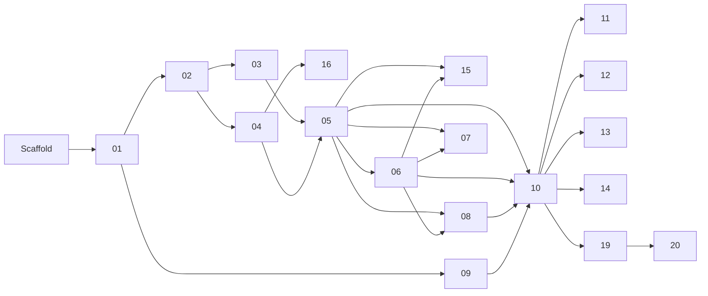

# Feature specs

One spec per feature, each small enough for one implementation session. Read
[`../architecture.md`](../architecture.md) first: it holds the shared domain model, the
tenancy/security rules and the conventions every spec assumes.

## Index and build order

Build in this order unless a spec's dependencies say otherwise. Letters refer to the
feature list agreed in the initial brainstorm.

| #   | Spec                                                                   | Feature | Depends on                 | Status      |
| --- | ---------------------------------------------------------------------- | ------- | -------------------------- | ----------- |
| 01  | [Auth and physio profile](./01-auth-and-physio-profile.md)             | Core    | Scaffold                   | Done        |
| 02  | [Body areas](./02-body-areas.md)                                       | H       | 01                         | Done        |
| 03  | [Exercise library](./03-exercise-library.md)                           | Core    | 01, 02                     | Done        |
| 04  | [Customers and cases](./04-customers-and-cases.md)                     | Core    | 01, 02                     | Done        |
| 05  | [Routines](./05-routines.md)                                           | Core    | 03, 04                     | Done        |
| 06  | [Weekly plans](./06-weekly-plans.md)                                   | Core    | 05                         | Done        |
| 07  | [Templates](./07-templates.md)                                         | A       | 05, 06                     | Done        |
| 08  | [Phases and progression](./08-phases-and-progression.md)               | B       | 05, 06                     | Done        |
| 09  | [Physio branding](./09-physio-branding.md)                             | F       | 01                         | Done        |
| 10  | [Sharing and patient page](./10-sharing-and-patient-page.md)           | Core    | 05, 06, 08, 09             | Done        |
| 11  | [Link previews](./11-link-previews.md)                                 | E       | 09, 10                     | Done        |
| 12  | [Workout mode](./12-workout-mode.md)                                   | C       | 10                         | Hidden      |
| 13  | [Session logging and dashboard](./13-session-logging-and-dashboard.md) | D       | 10 (12 optional)           | Done        |
| 14  | [PDF and Excel export](./14-export-pdf-and-excel.md)                   | Core    | 05, 06, 09, 10             | Done        |
| 15  | [Version history](./15-version-history.md)                             | I       | 05, 06                     | Done        |
| 16  | [Visit notes](./16-visit-notes.md)                                     | J       | 04                         | Done        |
| 17  | [Spanish locale](./17-spanish-locale.md)                               | Core    | 01                         | Done        |
| 18  | [Installable physio app (PWA)](./18-pwa.md)                            | Core    | 01, 17                     | Done        |
| 19  | [Patient page v2](./19-patient-page-v2.md)                             | C, D    | 05, 06, 10, 12, 13, 14, 15 | Done        |
| 20  | [Inline exercise log](./20-inline-exercise-log.md)                     | D       | 13, 19                     | In progress |

Specs 09, 15 and 16 can be built in parallel with the main chain once their dependencies are
done.

## Deferred (agreed "later")

Seed exercise library / CSV import (G), uploaded exercise media (videos/images, Vimeo; spec 03
ships YouTube links only), outcome measures (K), offline patient page (L), AI assist (M), GDPR
tooling (N), patient reminders (O), clinics/teams, billing. Write a spec with
[`_template.md`](./_template.md) when one is picked up.

## Working on a spec

The full loop (clarify → design approval → autonomous build → PR → merge on approval) is in
the "Workflow" section of [`CLAUDE.md`](../../CLAUDE.md). Spec-specific parts:

1. Start a new session on a new branch (`feat/NN-<name>`).
2. Read `CLAUDE.md`, `docs/architecture.md`, the spec and the specs it depends on.
3. Ask the user the spec's **Open questions** before designing; record the answers in the spec.
4. After the design is approved, write the implementation plan (`docs/plans/NN-<name>.md`)
   and build it test-first.
5. Before opening the PR, set **Status** to `Done` here and in the spec, and note any
   deviations in the spec's **Decisions made during implementation** section.
